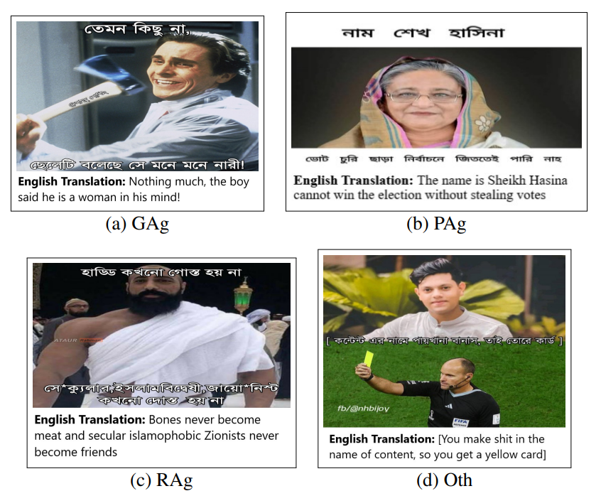

# 🔥A Multimodal Framework to Detect Target-Aware Aggression in Memes (EACL'24)

Internet memes have gained immense traction as a medium for individuals to convey emotions, thoughts, and perspectives on social media. While memes often serve as sources of humor and entertainment, they can also propagate offensive, incendiary, or harmful content, deliberately targeting specific individuals or communities. Identifying such memes is challenging because of their satirical and cryptic characteristics. Most contemporary research on memes’ detrimental facets is skewed towards high-resource languages, often sidelining the unique challenges tied to low-resource languages, such as Bengali. To facilitate this research in low-resource languages, this paper presents a novel dataset **MIMOSA** (MultIMOdal aggreSsion dAtaset) in Bengali. **MIMOSA** encompasses 4,848 annotated memes across five aggression target categories: Political, Gender, Religious, Others, and non-aggressive. We also propose **MAF** (Multimodal Attentive Fusion), a simple yet effective approach that uses multimodal context to detect the aggression targets. MAF captures the selective modality-specific features of the input meme and jointly evaluates them with individual modality features. Experiments on **MIMOSA** exhibit that the proposed method outperforms several state-of-the-art rivaling approaches. 

<p align="center">
    <a href="https://llava.hliu.cc/"></a> <br>
    Aggression Memes Samples.
</p>

**Author:** Shawly Ahsan, Eftekhar Hossain, Omar Sharif, Avishek Das, Mohammed Moshiul Hoque, M. Ali Akber Dewan 

💥[Paper Link](https://aclanthology.org/2024.eacl-long.153/)


# ✨How to Run

The following instructions will show how to run the **MAF** model on the **MIMOSA** dataset. You can apply it to any multimodal (image+text) dataset with slight modifications in the `dataset.py` file. The scripts are built on `Python 3.10.12`

1. Clone this repository and navigate to Bengali-Aggression-Memes folder
```bash
git clone https://github.com/shawlyahsan/Bengali-Aggression-Memes.git
cd Bengali-Aggression-Memes
```

2. Install Packages 
```Shell
pip install -r requirements.txt  # download the required libraries
```

3. Directory
Folders should organized as follows in `Bengali-Aggression-Memes`

```
├── Dataset
|   ├── Img
    |  ├── .jpg
    |  └── .png
|   └── .csv files
├── Scripts
   └── .py files
└── requirements.txt           
```

3. Run the code

```bash
cd Scripts  # Set Scripts folder as the current directory 
```
```bash
python main.py  # run directly in the terminal with default arguments 
```

Arguments:

- `--dataset`: the path of the dataset folder - `default: 'Dataset'`
- `--max_len`: the maximum text length - `default: 70`
- `--batch_size`: `default: 16`
- `--model`: the saved models' path after training -`default: 'Saved_Models'`
- `--heads`: number of attention heads - `default: 16`
- `--n_iter`: number of epochs - `default: 5`
- `--lrate`: learning rate -  `default: 5e-5`


After calling `main.py,` you will see a classification report of the model's performance on the test set for the respective task.


## Citation

If you are using our code, dataset, or models for your research work, then please cite our paper below:
```bibtex
@inproceedings{ahsan2024multimodal,
  title={A Multimodal Framework to Detect Target Aware Aggression in Memes},
  author={Ahsan, Shawly and Hossain, Eftekhar and Sharif, Omar and Das, Avishek and Hoque, Mohammed Moshiul and Dewan, M},
  booktitle={Proceedings of the 18th Conference of the European Chapter of the Association for Computational Linguistics (Volume 1: Long Papers)},
  pages={2487--2500},
  year={2024}
}
```
